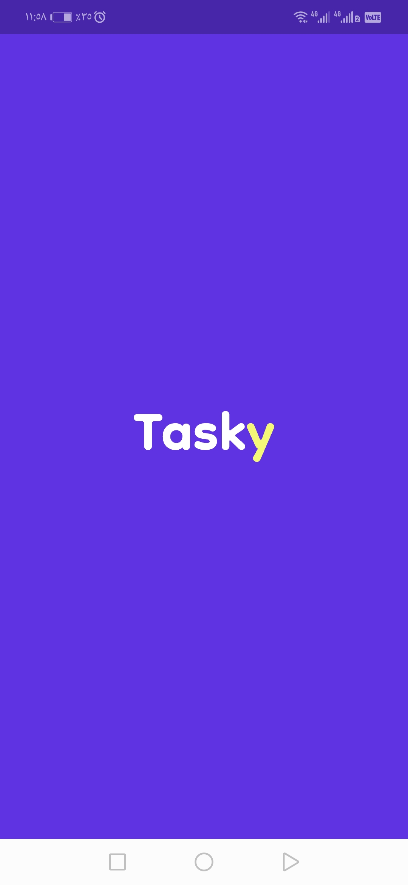
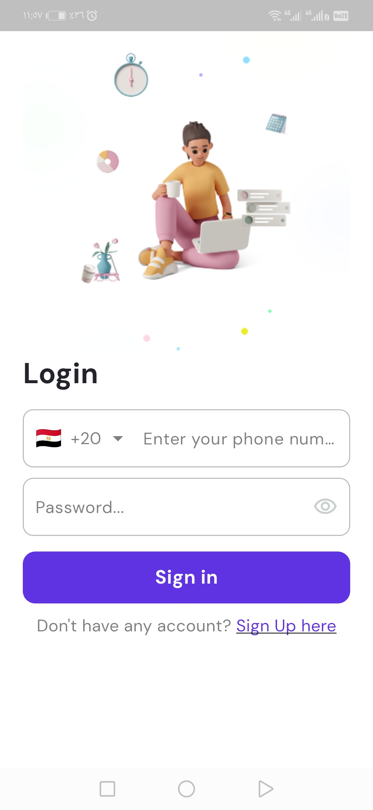
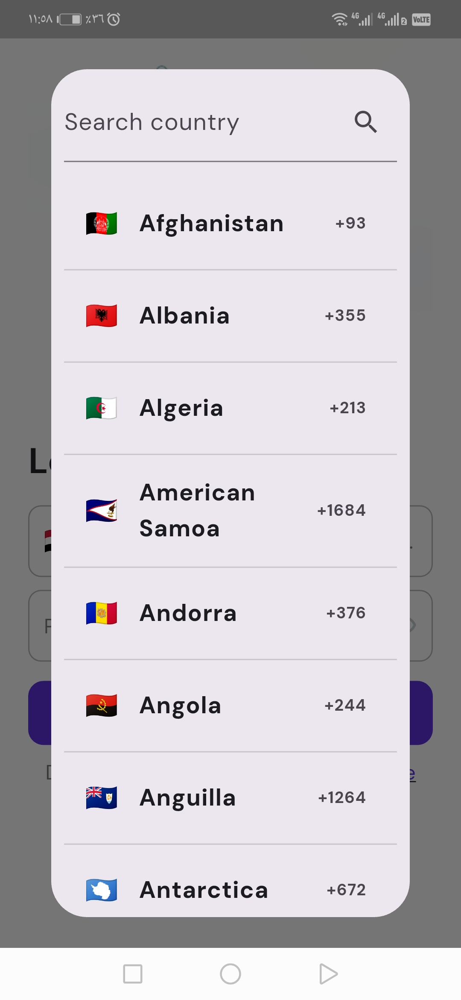
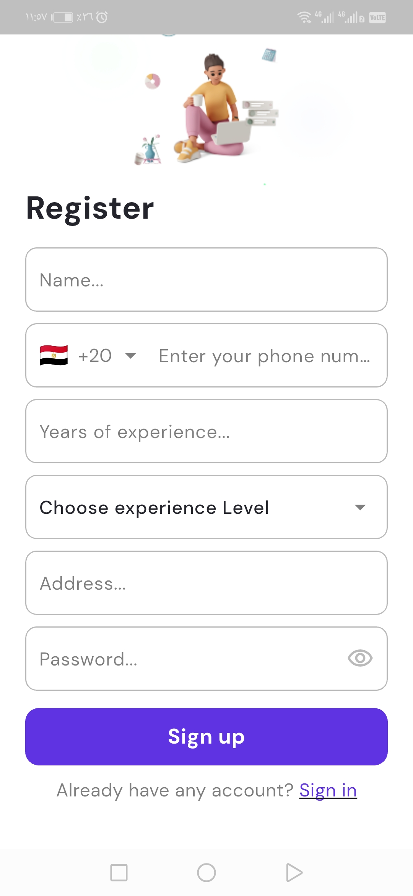
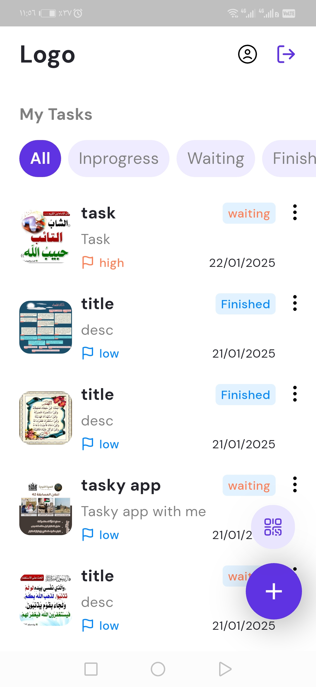
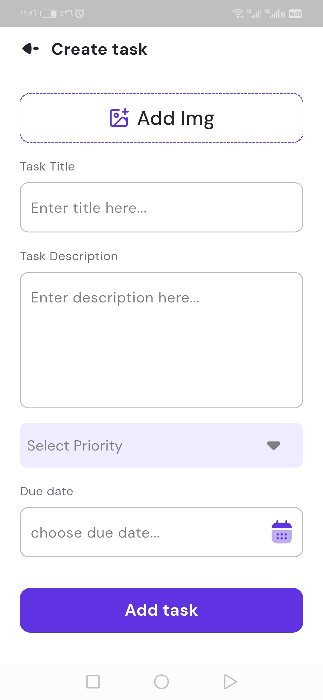
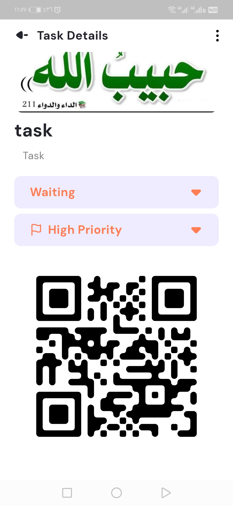
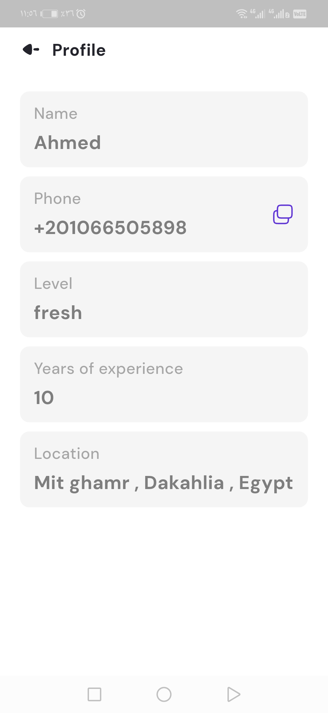

# ✅ Tasky - Todo App   ( 53 work hour )


A powerful and responsive **Flutter** todo app that supports secure **authentication**, smart **QR code** interaction, image attachments, and real-time task access. Built for productivity on any device.

---

## 🚀 Features

- 🔐 **Login** with phone number & password  
- 🌍 Country-based **phone number validation**  
- 🪪 JWT-based **Authorization** with token refresh  
  - `401`: Access expired – refresh token  
  - `403`: Refresh failed – log out  
  - `200`: Token refreshed – retry request  
- 📝 Todo List:
  - Infinite scrolling  
  - Pull-to-refresh  
  - Loading / Empty / Error states  
- 📸 **Add images** to todos via camera or gallery  
- 📎 **QR Code** generated from todo ID (on detail screen)  
- 📷 **QR Scanner** fetches todo by scanning and hitting `/todos/:id`  
- 📱 **Fully responsive design** for all screens  

---

## 📸 Screenshots

<div align="center">




<br><br>




<br><br>




<br><br>




</div>

---

## 🛠️ Tech Stack

- **Framework**: [Flutter](https://flutter.dev/)
- **Language**: Dart  
- **State Management**: (e.g., Provider, Bloc – specify if used)  
- **Authentication**: JWT with refresh token logic  
- **Camera & Media**: `camera`, `image_picker`  
- **QR Code**: `pretty_qr_code`  
- **API**: REST endpoints with secure token handling  
- **Platform**: Android / iOS  

---

## 📦 Installation

To run this app locally:

```bash
# Clone the repository
git clone https://github.com/AhmedNasser24/tasky_app.git

# Navigate into the project directory
cd tasky_app

# Get dependencies
flutter pub get

# Run the app on a device or emulator
flutter run
